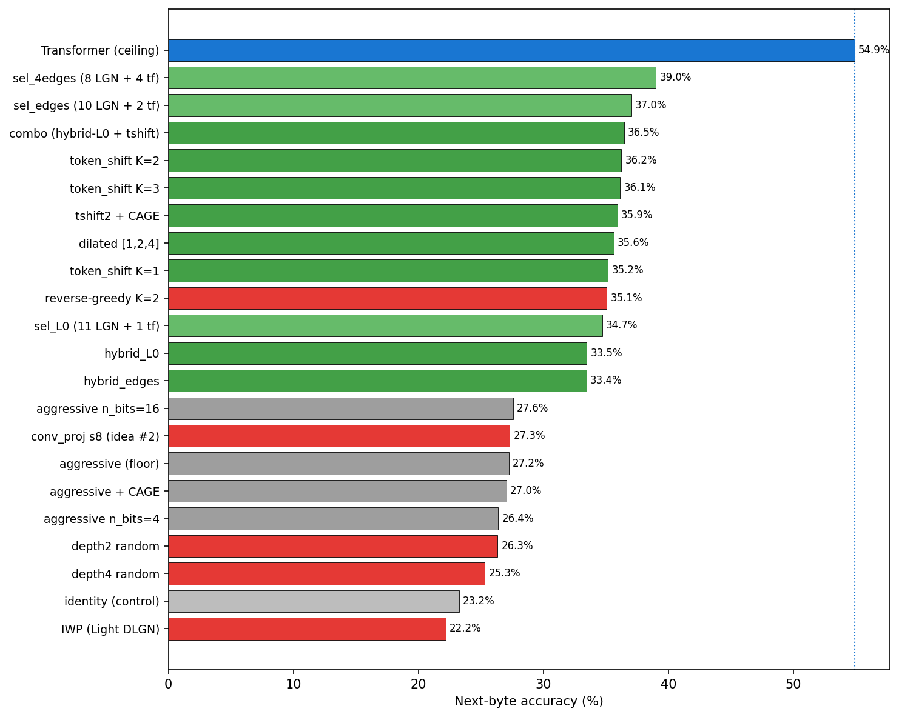
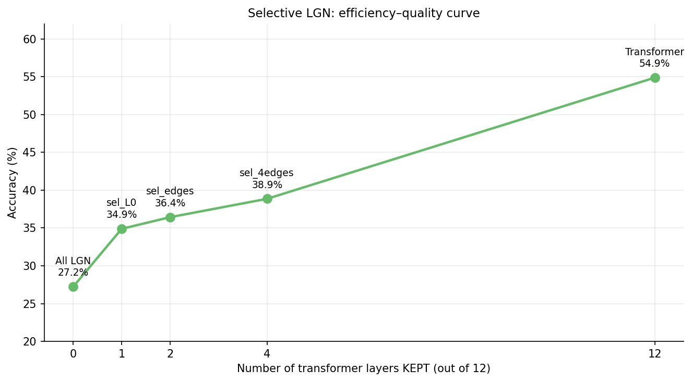

# LGN-Nano: Logic Gate Networks transformerio sluoksniuose

Tikrinu, kiek nanoGPT transformerio sluoksnių galima pakeisti į Boolean **Learned Logic
Gate Networks (LGN)** — ir ar iš to lieka realaus loginio darbo, ar tik aplinkinių Linear
sluoksnių kompensacija. Modelis: nanoGPT, 12 sluoksnių × 128d × 4 head'ai, byte-level
WikiText-2.

Trumpa esmė: per paskutinę savaitę išbandžiau ne vieną būdą pagerinti LGN, pritaikant jį
transformerio sluoksniams. Atsiremiu į aiškias **lubas**, kurių nepavyksta pramušti
paprastais architektūros pataisymais (funkcijų modifikavimai, gylis ir pan.). Nepaisant to,
kad LGN geriausiu atveju yra apie **35 % (santykinai) mažiau tikslus** nei transformeris,
jis yra gerokai **efektyvesnis** — kelis kartus mažiau parametrų ir 8–30× mažiau FLOPs,
priklausomai nuo konfigūracijos.

---

## Modelių apžvalga



| Modelis | Accuracy % | Ką keičia |
|---|---:|---|
| NanoGPT transformeris | **54.87** | 12 sluoksnių baseline (lubos) |
| Combo Hybrid LGN | 36.45 | L0 su pre-baked attention + token-shift K=2 |
| LGN + Transformer (selective) | 39.01 | 8 LGN + 4 transformer sluoksniai |
| Hybrid L0 | 33.5 | L0 attention pre-baked, MLP → LGN |
| Tik LGN (aggressive) | 27.22 | visi 12 sluoksnių grynas LGN |
| Identity | 23.25 | kontrolė (LGN nieko nedaro) |

Nustačiau, kad pagrindinis bottleneck, dėl kurio krenta visas tikslumas, yra **L0 (pirmas
sluoksnis) cross-token bottleneck**. Bandymai pagerinti būtent jį davė daugiausiai naudos, o
Boolean skaičiavimo optimizacijos (gilesni sluoksniai, platesni vartai, conv/linear
projekcijos) nedavė nieko arba labai nedaug. Problema ta, kad **kiekvienas tokenas pats iš
savęs daug nereiškia** — informacija ateina iš konteksto, kokie tokenai buvo prieš jį.
Transformeryje attention leidžia referencuoti buvusius tokenus, o LGN kiekvieną poziciją
apdoroja atskirai (pointwise), todėl praranda daug tikslumo.


---

## Hybrid L0

Aproachas, kuris neblogai veikia. Transformerio blokas turi dvi dalis — **MLP** ir
**attention**, ir aš keičiu tik MLP dalį. L0 sluoksniui **nukopijuoju attention dalį iš jau
ištreniruoto transformerio** (palieku ją užšaldytą), o LGN naudoju tik vietoj MLP. Taip LGN
gauna nebe raw embedding'ą, o **attention jau apdorotą srautą** — tokenus, į kuriuos jau
įmaišyta informacija iš kitų pozicijų. Tai pakelia accuracy nuo 27.2 % iki **33.5 %**.

---

## TokenShift

Metodas, kuris irgi davė neblogų rezultatų, ir net stipresnių nei Hybrid. Prieš paduodant
signalą į LGN sluoksnį, prie kiekvienos pozicijos **pridedu keletą praėjusių pozicijų** —
LGN mato `[x[t], x[t-1], ..., x[t-K]]`. Tarkim, K=2 reiškia, kad pozicija mato save ir 2
atgal. Tai duoda vartams lokalų cross-token langą **pigiai ir sąžiningai** (tik fiksuotas
pozicijų postūmis, jokių mokomų parametrų — skirtingai nei conv/linear, kur papildomas
sluoksnis pats išmoktų dalį darbo).


| Config | Accuracy % |
|---|---:|
| Be cross-token | 27.22 |
| Token_shift K=1 | 35.16 |
| **Token_shift K=2** | **36.22** |
| Token_shift K=3 | 36.13 |

Priešingai nei Hybrid, TokenShift taikiau **visiems sluoksniams** (labiausiai naudingas L0
ir L10/L11 — būtų galima sutaupyti resursų taikant tik ten). Šie du metodai aiškiai sprendžia
**tą pačią** problemą: jų kombinacija beveik nieko nepakeičia (Combo tik truputį geriau nei
vienas Token_shift), todėl TokenShift neblogai imituoja attention dalį.

---

## Selective LGN

Patikrinau, kiek galima palikti transformer sluoksnių, paaukojant efektyvumą už tikslumą.



| Palikti transformer | LGN sluoksnių | Accuracy % | Parameters |
|---:|---:|---:|---:|
| 0 | 12 | 27.22 | 0.37 M |
| 1 (L0) | 11 | 34.70 | 0.55 M |
| 2 (L0, L11) | 10 | 37.03 | 0.72 M |
| 4 (L0, L1, L10, L11) | 8 | 39.01 | 1.07 M |
| 12 (baseline) | 0 | 54.87 | 2.45 M |

---

## LGN kaip FFN pakaitalas: kur tikrosios lubos?

Ankstesni rezultatai painiojo du dalykus — *cross-token* (attention) ir *per-token* (FFN)
darbą. Kad atskirčiau, atlikau švarų eksperimentą: **užšaldau ištreniruotą attention VISUOSE
12 sluoksnių** (ne tik L0) ir leidžiu LGN pakeisti **tik FFN/MLP** dalį. Klausimas grynas:
*kiek gerai LGN gali imituoti FFN, kai attention idealus?*

| Modelis | Accuracy % | Ką izoliuoja |
|---|---:|---|
| Transformeris | 54.82 | lubos |
| Attention + LGN-FFN (visi 12) | 35.35 | grynas per-token LGN |
| Attention + identity-LGN (vartai išjungti) | 26.46 | tik „instaliacija" (ln + pooling + residual) |
| Tik attention (FFN pašalintas) | 5.46 | grindys — FFN vertas +49 pp |

**Pirma išvada — attention nebuvo vienintelė problema.** Net su idealiu attention LGN-FFN
pasiekia tik 35 % (atotrūkis 19.5 pp). Įdomu, kad tai *toks pat* rezultatas kaip TokenShift
(36.2 %) — t.y. atsitrenkėme į **„LGN-kaip-FFN lubas", nepriklausomas nuo to, kaip sprendžiam
cross-token.** Jautriausi FFN sluoksniai: **L0 ≫ L11 > L10 > L9**; vidurio FFN (L1–L6) beveik
nemokami. Kontrolė patvirtina, kad vartai dirba realiai (ne „instaliacija"): jie prideda
+8.9 pp virš identity-LGN.

### Kas yra tikrasis svertas — NE precizija, o vartų KIEKIS

Hipotezė buvo, kad bottleneck'as — binarizacijos precizija. Sistemingai patikrinau ir
**atmečiau** ją:

- **Įvesties precizija nesvarbi.** `out_mult2` (8-bit įvestis) ≈ `n_bits16` (16-bit įvestis) —
  perpus mažiau įvesties bitų, tas pats rezultatas.
- **Skaitymo (readout) precizija nesvarbi.** `weighted_pool` (mokomi per-bitiniai svoriai →
  iki 2^g lygių vietoj g+1, be papildomų vartų) **nieko nedavė** (35.31 % ≈ 35.35 % bazė).
  Protingesnis tų pačių vartų nuskaitymas nepadeda.
- **Vartų kiekis — DUODA.** Daugiau išvesties vartų kanalui: 35.4 → 38.3 → 41.8 % (vartai
  1× → 2× → 4×).

Taigi LGN-FFN atotrūkį riboja **skaičiavimo talpa (vartų kiekis)**, ne kodavimo/nuskaitymo
precizija. Protingesnis nuskaitymas talpos nepakeičia.

### Efektyvumo svertas: vartų ARITETAS (k-input LUT)

Jei riba — vartų kiekis, klausimas: *ar galingesnis primityvas padaro daugiau vienam
vartui?* 2-input vartas yra silpniausias įmanomas. Įdiegiau **k-input LUT vartą** (LUT-K:
mokoma 2^K-įrašų lentelė per multitiesį išplėtimą; hard-snap'inasi į vieną FPGA LUT-K).
Matavimas ant L0 (sunkiausio sluoksnio), vienodas vartų kiekis:

| Primityvas | FPGA LUT | L0 degradacija |
|---|---:|---:|
| 2-input | 1× | 0.435 |
| LUT3 | 1× | 0.287 |
| LUT4 | 1× | 0.213 |
| LUT6 | 1× | **0.156** |
| 2-input (2× vartų) | 2× | 0.200 |
| 2-input (4× vartų) | 4× | 0.098 |

**LUT4 (1 vartas) ≈ 2-input (2 vartai); LUT6 (1 vartas) ≈ 2-input (~2.7 vartai)** — bet
**TIK ant L0** (sunkiausio sluoksnio). LUT6 yra FPGA natūralus vienetas (Xilinx/AMD).

⚠️ **Sąžininga korekcija — L0 efektas nepersikelia į visą modelį.** Kai LUT4 paleidžiu
visuose 12 sluoksnių (švarus batch 32, gradient checkpointing dėl atminties), gaunu tik
**36.28 %** — t.y. **+0.9 pp** virš to paties vartų kiekio 2-input bazės (35.35 %), o vartų
*padvigubinimas* (out_mult2) duoda +3.0 pp. Priežastis: **tik keli sunkūs sluoksniai
(L0/L10/L11) gauna naudos iš galingesnio primityvo**; vidurio FFN ir taip lengvi, tad
vidurkis stipriai atskiedžiamas. Taigi „~2.7× efektyvumas" yra **vieno-sunkaus-sluoksnio
potencialas, ne viso modelio daugiklis.** Aritetas — realus, bet **kuklus** (~+1 pp prie
vienodo vartų kiekio) svertas, svarbus ten, kur sluoksnis sunkus, ne visur. Būtent tokius
perdėjimus ir gaudo sąžiningų kontrolių disciplina.

Paleidimas (visi sluoksniai hibridiniai, LUT6 vartai, gradient checkpointing dėl atminties):
```bash
python run.py scale --hybrid_all --hybrid_ln2 copy_trainable --learn_pool \
  --lut_k 6 --grad_checkpoint --batch_size 16 \
  --heatmap results/report/hybrid_all_heat/heatmap.json --checkpoint results/baseline.pt
```

**Sąžiningumo pastaba:** visi šie skaičiai laiko **pilną float attention** visuose 12
sluoksnių, tad senas „29× mažiau FLOPs" čia nebegalioja — attention dabar dominuoja
skaičiavimą. Šios fazės tikslas buvo *suprasti* LGN-kaip-FFN ribą (talpa, ne precizija; LUT
aritetas kaip efektyvumo svertas), ne pasiekti naują efektyvumo rekordą.

---

## Literatūra

Peržvelgiau keletą naujesnių DLGN darbų:

- **„Mind the Gap" (NeurIPS 2025)** — bando soft–hard gap'ą mažinti Gumbel noise + STE.
  Jų image rezultatai geri, bet mano byte-LM setup'e nepasiteisino.
- **„Light DLGN" (2025)** — vartų reparametrizacija (IWP): 4× mažiau parametrų, greitesnis
  training. Irgi labiau tinka image recognition, čia nepasiteisino (−5 pp).
- **[Recurrent DDLGN (2025)](https://arxiv.org/abs/2508.06097)** — nagrinėja, manau,
  pagrindinę problemą: cross-token apribojimą. Į loginį tinklą įdedami **stateful vartai
  (flip-flops, latches)**, kurie leistų vartams dirbti su sekomis — galimai pakeistų
  attention pačiame LGN lygmenyje. Reikalauja didelio architektūros pertvarkymo; dar
  nespėjau patikrinti.
- **[CAGE „Align Forward, Adapt Backward" (2026)](https://arxiv.org/abs/2603.14157)** —
  sprendžia soft/hard gap'ą: forward daromas kietas (argmax, lygiai kaip inference), tad
  gap'as iš principo dingsta, o gradientas skaičiuojamas minkštai su adaptyvia temperatūra.
  Įdiegiau — gap'ą sumažino maždaug perpus (0.027 → 0.014), bet accuracy beveik nepasikeitė
  (27.0 % vs 27.2 %), nes mano gap'as ir taip buvo mažas.

---

## Konfigūracijos, kurios nieko reikšmingo nedavė

| Bandymas | Rezultatas | Kodėl |
|---|---|---|
| Depth + random interconnect | 25.3–26.3 % (kiek pablogėjo) | hard-snap klaidos kaupiasi |
| Conv/Linear projekcijos | „veikė labai gerai", bet ablation parodė, kad LGN tada nieko nebedaro | projekcija perima darbą (fake LGN) |
| Binary regularization (RDDLGN) | nieko nepagerina | — |
| Reverse greedy (sunkiausi pirma) | −1 pp | easy-first leidžia tinklui prisitaikyti |

---

## Efektyvumas

Kadangi pasiekti identiškų transformeriui rezultatų kol kas nepavyko, patikrinau, kiek
laimime efektyvumo. FLOPs/token — teorinis aritmetinių operacijų kiekis vienam tokenui,
susumuotas per 12 blokų: transformer bloke skaičiuoju attention + MLP matricų daugybas
(~213K/token bloke → 2.56 M iš viso), LGN bloke Linear sluoksnių nėra — lieka tik vartai
(kiekvienas ≈ 5 operacijos) ir sum_pool (~6K/token bloke → 0.075 M), t.y. ~34× mažiau.


| Config | Total params | FLOPs/token | LGN gates | Bool ops/token | FLOPs vs transformer |
|---|---:|---:|---:|---:|---:|
| Transformer | 2.45 M | 2.56 M | 0 | 0 | 1.0× |
| Aggressive | 0.37 M | 0.086 M | 12,288 | 36,864 | **29.7× fewer** |
| Hybrid L0 | 0.44 M | 0.168 M | 12,288 | 36,864 | 15.2× fewer |
| Token shift K=2 | 0.96 M | 0.258 M | 36,864 | 110,592 | 9.9× fewer |
| Combo | 1.03 M | 0.340 M | 36,864 | 110,592 | 7.5× fewer |

Realių hardware skaičių nelyginau, nes ant GPU LGN visada veikia prasčiau už transformerį —
GPU optimizuotas tankiai matricų daugybai, o diskretus „gather + gate eval" jam neefektyvus.
Tikrasis pranašumas realizuojamas **FPGA/ASIC**, kur kiekvienas 2-input vartas = 1 LUT.

---

## Recurrent / stateful LGN (RDDLGN-inspired, eksperimentinis)

Kaip pirmą žingsnį RDDLGN kryptimi, pridėjau **recurrent/stateful LGN sluoksnį** —
alternatyvą TokenShift'ui. Vietoj fiksuoto kaimynų lango, kiekvienam tokenui logikos
stack'as atnaujina **paslėptą būseną**:

```
state_t = Logic([token_bits_t, state_{t-1}])
out_t   = group_sum(state_t)
```

Tai causal (output pozicijoje t priklauso tik nuo tokenų ≤ t) ir leidžia logikai maišyti
informaciją per seką per būseną — būtent to pointwise vartai negali. **Tai NĖRA pilnas
RDDLGN encoder–decoder** — tik stateful mechanizmas, įgyvendintas kaip drop-in GPT-bloko
pakaitalas (`RecurrentLogicGateGPTLayer` / `HardRecurrentLogicGateGPTLayer`), suderinamas su
esamu imitation / fine-tune / scaling pipeline'u.

Paleidimas:
```bash
python run.py scale --recurrent --recurrent_layers 0 \
  --recurrent_state_width 1024 --recurrent_depth 1 --recurrent_state_init zero \
  --learn_pool --heatmap results/aggressive/heatmap.json --checkpoint results/baseline.pt
```
Be `--recurrent` viskas veikia kaip anksčiau (senas kelias nepakitęs).

### Gated (flip-flop / latch-inspired) būsenos atnaujinimas

Paprastas (vanilla) recurrent kiekviename žingsnyje **visą būseną perrašo** iš naujo
(`state_t = Logic([token_bits_t, state_{t-1}])`). Tai ir yra viena iš priežasčių, kodėl jis
atsilieka: nėra mechanizmo *išlaikyti* būsenos bitą per ilgesnę seką — informacija greitai
prarandama. Kaip pasirenkamą (opt-in) plėtinį pridėjau **gated** atnaujinimą, įkvėptą
flip-flop / latch logikos: be kandidato dar mokomas atskiras **keep** loginis vartų stack'as,
kuris sprendžia, ar laikyti seną bitą, ar perrašyti nauju:

```
candidate_t = LogicCandidate([token_bits_t, state_{t-1}])
keep_t      = LogicKeep([token_bits_t, state_{t-1}])
state_t     = keep_t * state_{t-1} + (1 - keep_t) * candidate_t   # soft
state_t     = where(keep_t, state_{t-1}, candidate_t)             # hard
```

`keep=1` palieka seną būsenos bitą, `keep=0` perrašo kandidatu. Svarbu: **keep vartas pats
yra mokomas LOGIKOS stack'as** (`LearnedLogicLayer`), ne sigmoid/dense gate'as — taip visas
mechanizmas lieka Boolean ir hard-snap'inamas (`HardGatedRecurrentLogicGateGPTLayer`).

Tai **flip-flop/latch-INSPIRED plėtinys, o ne teiginys, kad RDDLGN paper'is naudojo
GRU-stiliaus keep vartą.** Paleidimas (`--recurrent_gated` reikalauja `--recurrent`):
```bash
python run.py scale --recurrent --recurrent_gated --recurrent_layers 0 \
  --recurrent_state_width 1024 --recurrent_state_init zero \
  --learn_pool --heatmap results/aggressive/heatmap.json --checkpoint results/baseline.pt
```

## Kryptys toliau

Recurrent sluoksnio accuracy dar nepamatuota — tai sekantis žingsnis (state-width / depth /
init sweep'ai, ir ar jis pralenkia TokenShift'ą). Dabartinės implementacijos jau ženkliai
padidina efektyvumą FPGA/ASIC kontekste.
