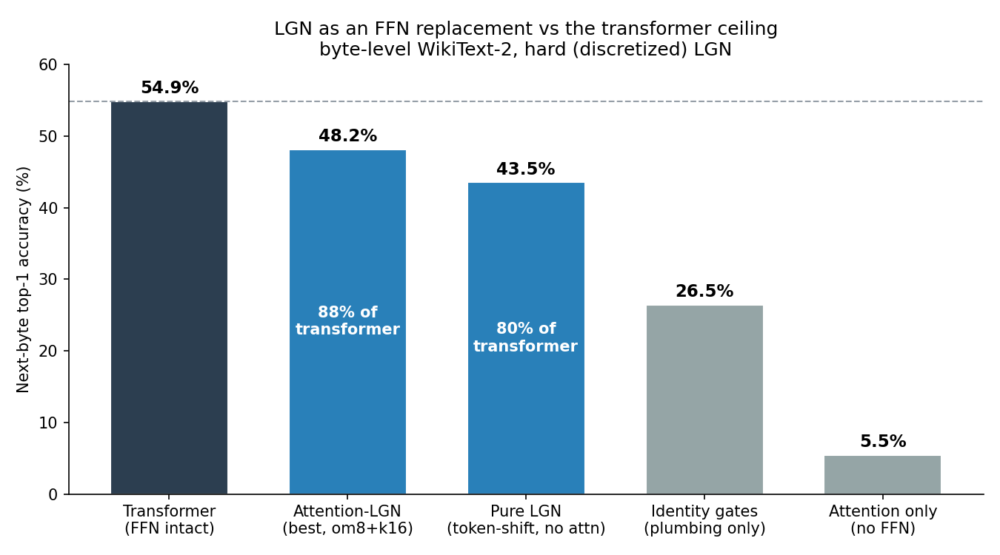
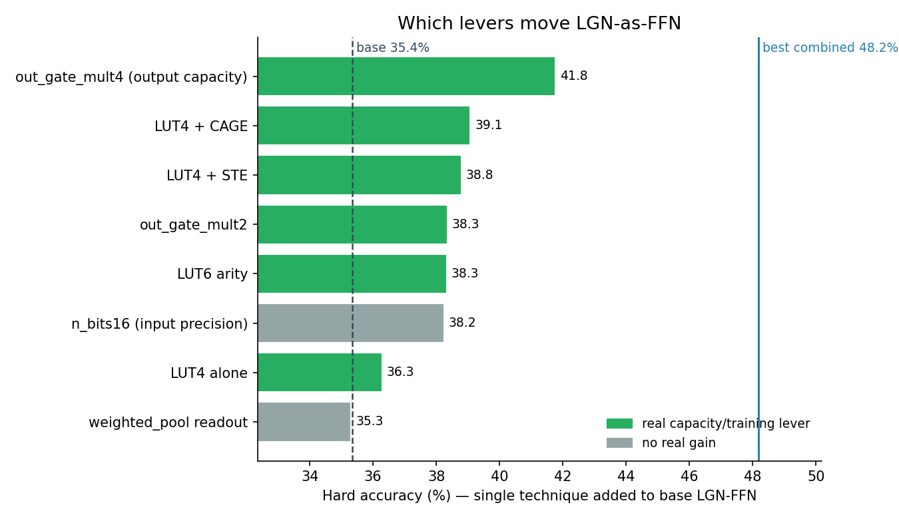
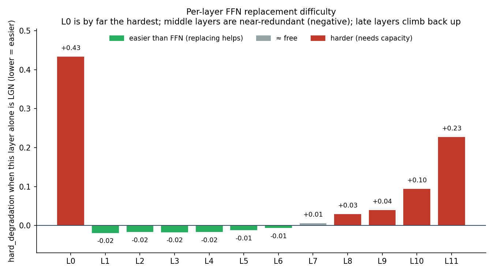
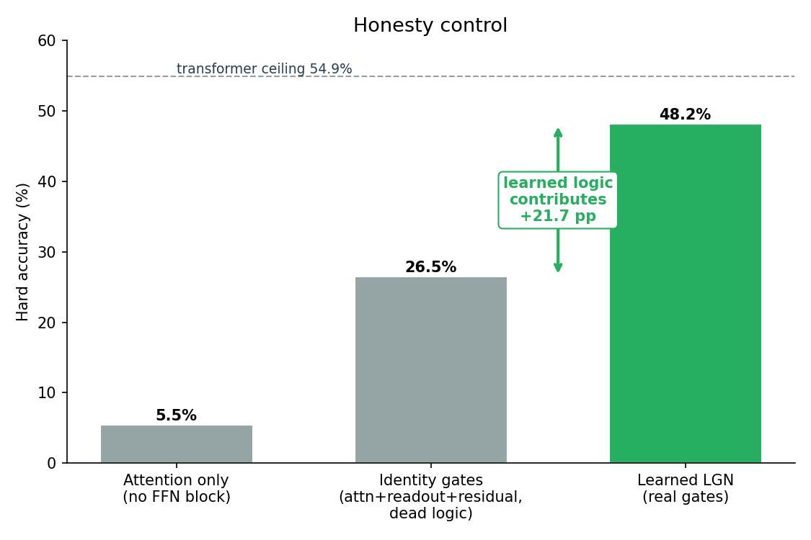
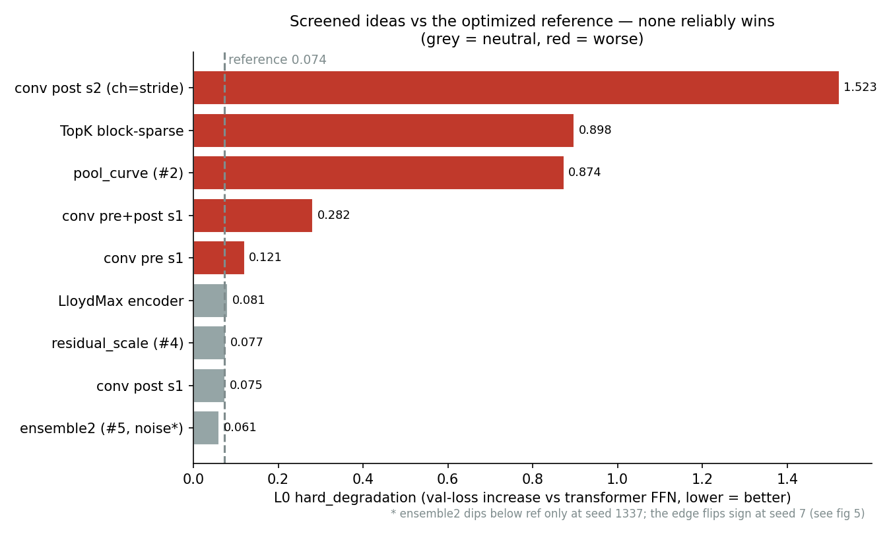
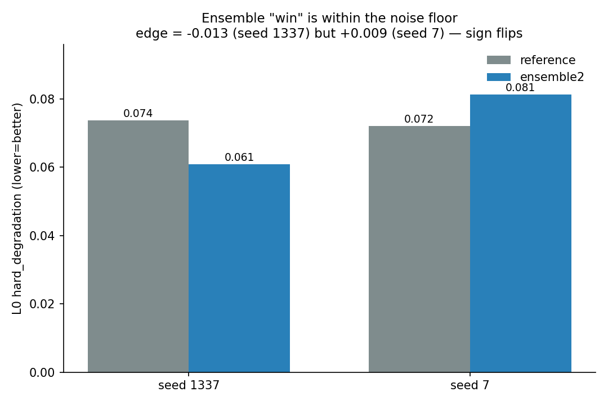
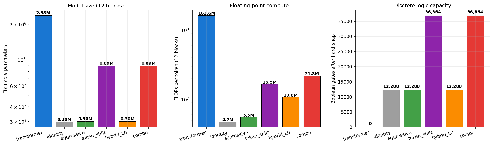

# LGN-Nano: FFN keitimas į Logic Gate Network transformeryje

Išbandžiau aproachą — optimizuoti LGN kaip FFN replacement, paliekant attention sluoksnį. Šis aproachas davė labai gerų rezultatų, kurie perėjo net ir į variantą be palikto attention, naudojant token shift.

Idėja tokia: užšaldęs jau ištreniruotą attention visuose 12 sluoksnių, keičiau tik FFN į LGN. Taip izoliuoju vieną klausimą — kiek gerai pats LGN gali atlikti per-token darbą, kai cross-token (attention) jau idealus. Metrika visur — next-byte top-1 accuracy ant fiksuoto (seed-1234) byte-level WikiText-2 val batch'o, ir LGN visada matuoju kaip **hard** (diskretų) modelį, lygiai kaip realiame inference, kad skaičius nebūtų išpūstas soft relaxation'o. Baseline'as buvo tik 35.4% acc (transformerio 54.87%), bet galiausiai pavyko pasiekti 48.18%, 88% transformerio.

## Kaip optimizavau

Pirmiausia trumpai, kaip LGN apskritai keičia FFN: gauna kanalo aktyvaciją, ją binarizuoja (kiekvienas iš 128 kanalų suspaudžiamas sigmoid'u ir paverčiamas `n_bits` thermometer bitais), paleidžia per learned gates stack'ą, ir output gates per kanalą sugrupuoja bei nuskaito atgal į float su sum_pool (suskaičiuoja vienetukus grupėje). Visa optimizacija — apie tai, kur šitame kelyje yra tikrasis bottleneck.

**Capacity, ne precision.** Pirmas dalykas, kurį teko atmesti, buvo prielaida, kad riboja binarizacijos tikslumas. Patikrinau iš abiejų pusių: 8-bit įvestis duoda praktiškai tą patį kaip 16-bit (perpus mažiau įvesties bitų — tas pats acc), o weighted_pool (mokami per-bitiniai readout svoriai, iki 2^g lygių vietoj g+1) nepridėjo nieko. Vadinasi nei kiek tiksliai užkoduoju įvestį, nei kaip protingai perskaitau output'ą, nėra riba — riba yra gryna **skaičiavimo talpa**: kiek gates ir kokie jie galingi.

Stipriausias svertas — **gate count output'e**. sum_pool nuskaito grupę gate output'ų į vieną skaičių, tad kuo daugiau gates grupėje, tuo daugiau galimų lygių vienam kanalui (didesnė readout rezoliucija). Vien padidinus output gates gaunu 35.4 → 38.3 → 41.8% (1× → 2× → 4×). Capacity dedu **netolygiai**: globaliai laikau 4×, o sunkiausiems sluoksniams (L0, L9, L10, L11) duodu 8×, nes likę sluoksniai tos talpos tiesiog nepanaudoja.

**Gate arity (LUT-K).** 2-input gate yra silpniausias primityvas — tik 16 Boolean funkcijų iš dviejų bitų. Pakeičiau jį k-input LUT gate: vietoj fiksuoto funkcijų rinkinio mokoma 2^K-įrašų truth table, soft treniruojant ji įvertinama per multilinear extension (tolydi K bitų interpoliacija), o hard'e snap'inasi į vieną diskrečią lentelę = vienas FPGA LUT-K. Taip vienas vartas išmoksta sudėtingesnę funkciją; ant sunkaus L0 LUT4 prilygsta maždaug 2× daugiau 2-input gates, LUT6 — ~2.7×. Visame modelyje efektas kuklesnis (~+0.9 pp prie vienodo gate count), nes nauda susikoncentruoja būtent sunkiuose sluoksniuose.

Kodėl būtent L0/paskutiniai: pakeitęs po vieną FFN ir pamatavęs degradaciją, matau aiškią hierarchiją — **L0 sunkiausias** (apie ×6 už bet kurį kitą), vidurio FFN (L1–L6) beveik nemokami (juos pakeitus val loss net pagerėja), o pabaiga (ypač L11) vėl pasunkėja. Todėl ir capacity, ir LUT-K nukreipiu ten, kur jų realiai reikia.

**Training svertai (be papildomų gates).** Diskretizacija reiškia soft–hard gap'ą: treniruoju tolydžiu (soft) modeliu, bet inference vyksta hard. Tris dalykus, kurie tą tvarko:

- **STE (straight-through estimator)** — forward einu diskrečiu keliu, o gradientą backward leidžiu pro jį tarsi būtų tolydus.
- **CAGE** — forward daromas kietas (argmax, lygiai kaip inference), tad gap'as principe dingsta, o backward skaičiuojamas minkštai su adaptyvia temperatūra (tau anneal'inu nuo aukštos prie žemos per fine-tune). Praktiškai gap'ą sumažina maždaug perpus.
- **Best-hard checkpoint** — renkuosi geriausią checkpoint'ą pagal *hard* val, ne soft, nes hard yra tai, kas realiai svarbu (~+0.8 pp).
- **KL distillation** — mokau LGN atkartoti ne tik teisingą byte'ą, bet ir visą transformerio output distribution (~+0.5 pp).

Connections taip pat svarbu: kiekvienas gate renkasi iš `k` kandidatinių input laidų per softmax (naudoju k=16), tad daugiau kandidatų — mažesnė tikimybė, kad vartas „užstrigs" prie blogo input'o.

**Pipeline.** Viskas suvedama nuosekliai: pirma kiekvieną LGN sluoksnį warm-startinu imituodamas originalaus FFN output'ą (MSE), tada fine-tune'inu viską kartu su LM loss + KL ir minėtais svertais, o sluoksnius keičiu po vieną — **lengviausią pirma** (pagal sunkumo heatmap'ą), kad likęs tinklas spėtų prisitaikyti prie kiekvieno naujo LGN sluoksnio. Sudėjus visus svertus (out_gate_mult 8 + k16 + LUT4 + CAGE + best-hard + KL), 35.4% pakilo iki **48.2%**.

## Ablation: ar gates tikrai dirba

Su tiek aplinkinių komponentų (ln, pooling, residual, užšaldytas attention) lengva apsigauti, kad pagerinimą duoda jie, o ne pati logika. Todėl padariau ablation testą — palikau visą „instaliaciją", bet išjungiau pačius gates (identity). Toks variantas pasiekia tik 26.5%, vadinasi išmoktas LGN realiai prideda **+21.7 pp** — gates tikrai atlieka darbą, ne pooling ar residual. (Apatinė riba: visai be FFN bloko lieka 5.5%.)

## Perėjimas į pure LGN

Svarbiausias patikrinimas — ar šie svertai veikia tik su realiu attention, ar persikelia ir į variantą visai be jo. Cross-token tada sprendžiu pigiai token-shift'u (prie kiekvienos pozicijos pridedu kelias praėjusias, jokių mokomų parametrų). Įdėjus tą patį optimizuotą LGN su token-shift vietoj attention, acc nukrito tik iki **43.54%, arba 80% transformerio**. Tai, kad optimizacija išsilaikė ir be attention, rodo, jog pagerinau būtent FFN-pakaitalą, ne pasinaudojau attention'u.

## Kaip testavau kitus pasiūlymus

Lygiagrečiai išbandžiau ir kitus pasiūlymus — Conv1D, LloydMax binarizer ir TopK block-sparse interconnect. Pilnas run'as (visi 12 sluoksnių, greedy scaling) trunka 12+ valandų, tad testavau efektyviai ir su griežtomis kontrolėmis, kad nieko nepaskelbčiau per anksti:

- **Tik ant L0.** Paleidžiu kandidatą tik ant sunkiausio sluoksnio (trumpas screen: ~50 imitation + 250 fine-tune steps), kur efektas turėtų būti ryškiausias. Tai pigu, bet L0 linkęs **perdėti** gain'us — todėl tai tik directional filtras, ne galutinis verdiktas.
- **Ablation control.** Kiekvienam priedui užšaldau pačius gates ir žiūriu, ar rezultatas vis tiek geras. Jei frozen-gates ≈ trained-gates, tai reiškia, kad darbą atlieka pats priedas, o ne LGN (fake LGN).
- **Seed-check.** Jei kažkas atrodo geriau už baseline'ą, pakartoju su kitu seed. Jei ženklas apsiverčia — tai tik triukšmas, ne realus pagerinimas.

Nė vienas priedas patikimai nepralenkė baseline'o, ir, mano supratimu, dėl tos pačios priežasties — visi jie taiko ne į modelio talpą, o į encoding, readout ar interconnect, t.y. ne į tą dimensiją, kuri yra bottleneck. Konkrečiai:

- **Conv1D** iš pradžių atrodė labai gerai, bet ablation parodė, kad užšaldžius gates rezultatas beveik tas pats — darbą atlieka pati convolution, ne LGN. Su stride dar ir prarandama informacija.
- **LloydMax binarizer** (per-channel EMA Gaussian thresholds) nieko nedavė, nes binarizacijos precision ir taip nebuvo problema (žr. capacity vs precision aukščiau).
- **TopK block-sparse interconnect** pasirodė net prastesnis nei paprastas random gate candidate parinkimas.

Seed-check vertė geriausiai matosi su vienu kandidatu (gate ensemble), kuris iš pradžių atrodė kaip realus pagerinimas (−0.013), bet su kitu seed ženklas apsivertė (+0.009) — t.y. telpa į screen'o triukšmą. Būtent dėl tokių mirage'ų nieko nelaikau pagerinimu be seed-kontrolės.

## Rezultatai ir kur esame

Trumpai apibendrinu. Pavyko parodyti, kad LGN realiai gali atlikti per-token (FFN) darbą — ne tik kompensuojamas aplinkinių sluoksnių — ir tą darbą gerokai suoptimizuoti. Galutiniai skaičiai:

| Modelis | Acc % | % transf. | Params | FLOPs vs transf. |
|---|---|---|---|---|
| NanoGPT transformeris (ceiling) | 54.87 | 100 | 2.45 M | 1× |
| Attention + LGN-FFN (optimized) | 48.18 | 88 | ≈ full attention | ~1× |
| Pure LGN (token shift, be attention) | 43.54 | 80 | ~0.96 M | ~10× fewer |
| Baseline LGN-FFN | 35.35 | 64 | — | — |
| Identity gates (control) | 26.46 | 48 | — | — |

Performance prasme įdomiausias pure LGN variantas: 80% transformerio acc su ~2.5× mažiau params ir ~10× mažiau FLOPs. Su attention variantu acc aukštesnis (88%), bet ten efficiency naudos nėra (attention dominuoja compute).

Vis dar liko 20% gap'as tarp transformerio ir LGN, kurio jau nelabai turiu idėjų kaip galima būtų kompensuoti — visi paprasti architektūros priedai jau patikrinti ir neduoda. Kita vertus, manau, kad 20% skirtumas su ~2.5× mažiau parametrų nėra blogas rezultatas.
